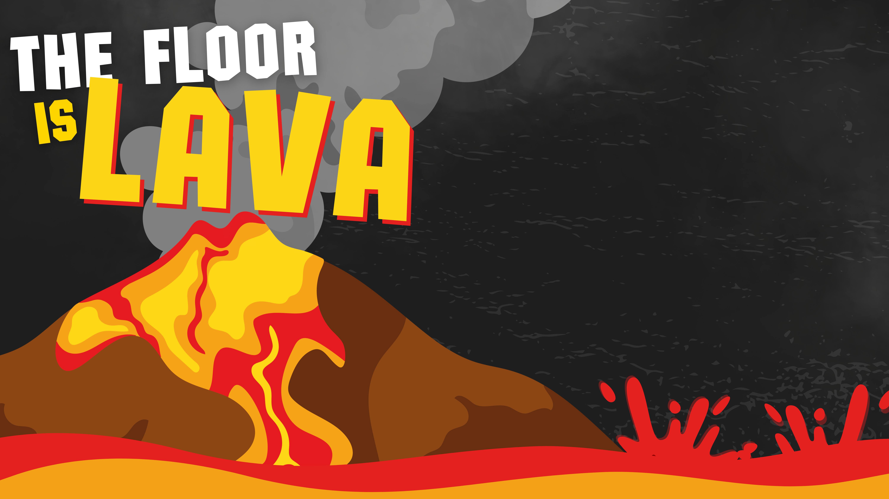

# The Floor is Lava
This is a simple 2D JavaFX Networking Game. The game revolves around the concept of “The Floor is Lava”. There is a platform consisting of normal tiles and lava tiles. Upon playing the game, 4 players are spawned on the platform. A player can push another player into a lava tile, making the other player take damage and lose a life. These players have 3 lives. They will keep battling it out and try their best to survive for the longest time. However, upon depleting your health pool, you are considered out and done for the game.

## How to Run
- Install the necessary requirements
    - Latest Java Version
        - For Windows:  https://www.java.com/download/ie_manual.jsp
        - For Linux: ```sudo apt install default-jdk```
    - JavaFX Components
        - Found through this link: https://docs.oracle.com/javafx/2/installation/jfxpub-installation.htm
    - (Optional) Visual Studio Code (For Developers) or Eclipse IDE for Java Developers
- Run the executable JAR file

## Game Sample
### Title Screen

### Lobby with Chat Features

### Gameplay Loop


## Members
### Group 5 (CMSC 137 B-4L)
#### Ebrahim Gabriel
#### Jea Anne Gadil
#### Chad Andrei Enriquez